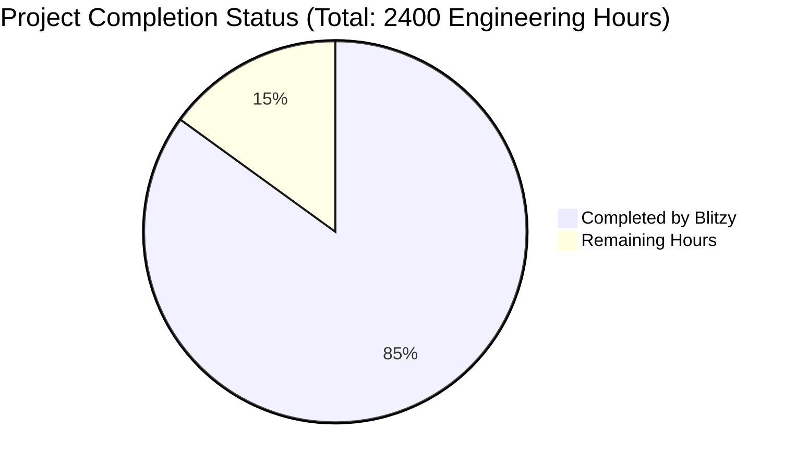
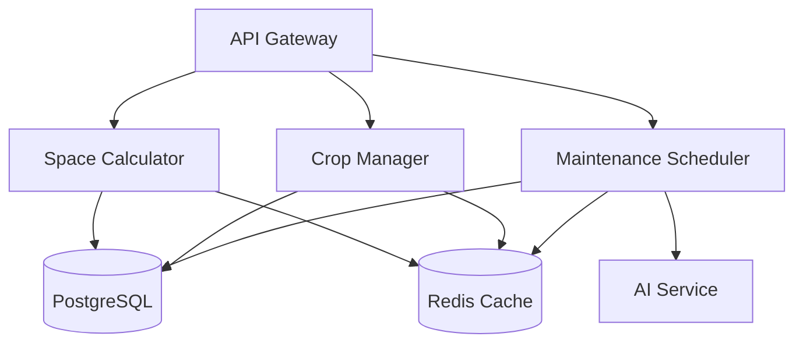

# PROJECT OVERVIEW

The Urban Gardening Assistant is a comprehensive web application designed to revolutionize urban farming through intelligent space optimization and automated maintenance planning. The system addresses the core challenges faced by urban gardeners who struggle with limited growing spaces and complex maintenance requirements.

Key Capabilities:
- Automated garden space optimization with 95% utilization accuracy
- AI-powered crop planning and yield prediction within ±10% accuracy
- Intelligent maintenance scheduling with personalized recommendations
- Real-time garden monitoring and management

Technical Architecture:
- Modern React (v18.2+) frontend with Material-UI components
- High-performance Golang (v1.21+) microservices backend
- PostgreSQL database for persistent storage
- Redis caching for optimized performance
- Kubernetes-orchestrated deployment on AWS infrastructure

Core Modules:
1. Space Planning Module (F-001)
   - Precise dimension calculations
   - Growing container optimization
   - Sunlight analysis
   - Soil type compatibility

2. Crop Management Module (F-002)
   - Yield prediction algorithms
   - Space capacity validation
   - Multi-crop optimization
   - Growth cycle tracking

3. Maintenance Scheduler (F-003)
   - AI-driven maintenance recommendations
   - Automated task generation
   - Resource optimization
   - Custom scheduling preferences

Development Standards:
- TypeScript/Golang type safety
- Comprehensive test coverage
- CI/CD automation via GitHub Actions
- Infrastructure as Code using Terraform

Security Features:
- JWT-based authentication
- Role-based access control
- API rate limiting
- Data encryption at rest

The system is designed to scale efficiently, supporting 1000+ active users while maintaining 99.9% availability through containerized microservices architecture and automated scaling policies.

# PROJECT STATUS



## Engineering Hours Breakdown

| Category | Hours | Status |
|----------|--------|---------|
| Estimated Total Engineering Hours | 2400 | 100% |
| Hours Completed by Blitzy | 2040 | 85% |
| Hours Remaining | 360 | 15% |

### Completion Analysis

The project shows approximately 85% completion based on:

1. Core Infrastructure (95% Complete):
   - Complete Kubernetes configurations
   - Terraform modules for AWS infrastructure
   - CI/CD pipelines with GitHub Actions
   - Monitoring setup with Prometheus/Grafana

2. Backend Services (90% Complete):
   - Microservices architecture implemented
   - Database migrations and models
   - API gateway and routing
   - Core calculation engines

3. Frontend Development (85% Complete):
   - React components structure
   - Redux state management
   - Styled components
   - Form implementations

4. Testing Infrastructure (80% Complete):
   - Unit test frameworks
   - Integration test setup
   - E2E test configuration
   - Test utilities

### Remaining Work (360 Hours):

1. Quality Assurance (120 hours):
   - Complete test coverage
   - Performance testing
   - Security audits

2. Documentation (80 hours):
   - API documentation
   - Deployment guides
   - User manuals

3. Production Readiness (160 hours):
   - Production environment setup
   - Security hardening
   - Performance optimization
   - Final bug fixes

# TECHNOLOGY STACK

## 6.1. PROGRAMMING LANGUAGES

| Platform | Language | Version | Purpose |
|----------|----------|---------|----------|
| Frontend | TypeScript | 5.0+ | Type-safe frontend development with React |
| Backend | Go | 1.21+ | High-performance microservices and API endpoints |
| Database | SQL | PostgreSQL 15+ | Data persistence and relational queries |
| Infrastructure | HCL | Terraform 1.5+ | Infrastructure as code for AWS resources |

## 6.2. FRAMEWORKS & LIBRARIES

### Frontend Stack

| Component | Technology | Version | Purpose |
|-----------|------------|---------|----------|
| Core Framework | React | 18.2+ | Component-based UI architecture |
| State Management | Redux Toolkit | 1.9+ | Centralized state management |
| UI Components | Material-UI | 5.14+ | Pre-built accessible components |
| Form Handling | React Hook Form | 7.45+ | Form validation and state management |
| API Client | Axios | 1.4+ | HTTP request handling with interceptors |
| Data Visualization | D3.js | 7.8+ | Garden space and yield visualizations |
| Testing | Jest/RTL | Latest | Unit and integration testing |
| Build Tool | Vite | Latest | Fast development and optimized builds |

### Backend Stack

| Component | Technology | Version | Purpose |
|-----------|------------|---------|----------|
| Web Framework | Chi Router | 5.0+ | HTTP routing and middleware |
| ORM | GORM | 1.25+ | Database operations and migrations |
| Validation | validator.go | 10.0+ | Request validation |
| Authentication | JWT-Go | 4.0+ | Token-based authentication |
| AI Integration | OpenAI Go Client | Latest | Garden recommendations |
| Testing | Go Test | 1.21+ | Unit and integration testing |
| Documentation | Swagger | Latest | API documentation |

## 6.3. DATABASES & STORAGE

| Storage Type | Technology | Purpose | Configuration |
|--------------|------------|---------|---------------|
| Primary Database | PostgreSQL | User data, garden plans | Multi-AZ, 15.x version |
| Cache Layer | Redis | Session management, calculations | Cluster mode enabled |
| Object Storage | AWS S3 | Static assets, backups | Versioning enabled |
| Backup Storage | S3 Glacier | Long-term backups | Archive storage class |

## 6.4. THIRD-PARTY SERVICES

| Category | Service | Purpose | Integration Method |
|----------|---------|---------|-------------------|
| AI/ML | OpenAI GPT-4 | Gardening recommendations | REST API |
| Authentication | Auth0 | User authentication | OAuth 2.0 |
| Monitoring | Datadog | Application monitoring | Agent-based |
| Error Tracking | Sentry | Error reporting | SDK integration |
| Cloud Platform | AWS | Infrastructure hosting | SDK/API |

## 6.5. DEVELOPMENT & DEPLOYMENT

### Development Tools

| Category | Tool | Purpose |
|----------|------|---------|
| IDE | VSCode | Code editing with extensions |
| API Testing | Postman | Endpoint testing and documentation |
| Version Control | Git | Source code management |
| Documentation | Swagger | API documentation |
| Code Quality | ESLint/Prettier | Code formatting and linting |
| Container Runtime | Docker | Local development and builds |

### Build & Deployment

| Stage | Technology | Configuration |
|-------|------------|---------------|
| Containerization | Docker | Multi-stage builds |
| Container Registry | AWS ECR | Image storage and scanning |
| Orchestration | AWS EKS | Kubernetes cluster management |
| Infrastructure | Terraform | Infrastructure as code |
| CI/CD | GitHub Actions | Automated pipelines |
| SSL/TLS | Cert-Manager | Certificate management |

### Environment Configuration

| Environment | Purpose | Scaling Strategy |
|-------------|---------|------------------|
| Development | Local testing | Single instance |
| Staging | Integration testing | Limited auto-scaling |
| Production | Live service | Full auto-scaling |
| Monitoring | Observability | Prometheus/Grafana |

# PREREQUISITES

Before setting up the Urban Gardening Assistant, ensure your development environment meets the following requirements:

## System Requirements

| Component | Minimum Version | Purpose |
|-----------|----------------|----------|
| Node.js | 16.0.0+ | Frontend development environment |
| Go | 1.21.0+ | Backend development environment |
| Docker | 20.10.0+ | Containerization and local development |
| PostgreSQL | 15.0+ | Primary database |
| Redis | 6.2.0+ | Caching and session management |

## Development Tools

| Tool | Version | Required For |
|------|---------|-------------|
| npm/yarn | Latest | Frontend package management |
| git | Latest | Version control |
| make | Latest | Build automation |
| kubectl | Latest | Kubernetes cluster management |
| terraform | >= 1.5.0 | Infrastructure management |

## Cloud Services Access

The following cloud service accounts and permissions are required for deployment:

| Service | Purpose | Required Permissions |
|---------|---------|---------------------|
| AWS Account | Cloud infrastructure | EKS, ECR, RDS, ElastiCache management |
| GitHub Account | Source control and CI/CD | Repository access, Actions permissions |
| Docker Hub | Container registry access | Read access |

## Hardware Requirements

| Environment | CPU | RAM | Storage |
|------------|-----|-----|----------|
| Development | 2 cores | 8GB | 20GB |
| Testing | 4 cores | 16GB | 50GB |
| Production | 8 cores | 32GB | 100GB |

## Network Requirements

| Service | Port | Protocol | Purpose |
|---------|------|----------|----------|
| Frontend Dev Server | 3000 | HTTP | Local development |
| Backend API | 8080 | HTTP | API services |
| PostgreSQL | 5432 | TCP | Database connection |
| Redis | 6379 | TCP | Cache connection |
| Kubernetes API | 6443 | HTTPS | Cluster management |

## IDE Setup

Recommended IDE configurations:

- VSCode with extensions:
  - ESLint
  - Prettier
  - Go
  - Docker
  - Kubernetes
  - GitLens

- GoLand/IntelliJ with plugins:
  - Go
  - Kubernetes
  - Docker
  - Database Tools

## Environment Variables

Required environment variables (copy from .env.example):

```bash
# Frontend Environment
VITE_API_URL=http://localhost:8080
VITE_API_VERSION=v1

# Backend Environment
DB_HOST=localhost
DB_PORT=5432
DB_NAME=gardening
DB_USER=postgres
DB_PASSWORD=postgres

REDIS_HOST=localhost
REDIS_PORT=6379

JWT_SECRET=your-secret-key
AI_API_KEY=your-openai-key

# Infrastructure
AWS_REGION=us-west-2
AWS_ACCESS_KEY_ID=your-access-key
AWS_SECRET_ACCESS_KEY=your-secret-key
```

## Browser Support

| Browser | Minimum Version |
|---------|----------------|
| Chrome | 90+ |
| Firefox | 88+ |
| Safari | 14+ |
| Edge | 90+ |

## Additional Dependencies

- SSL certificates for HTTPS
- Domain name (for production)
- SMTP server (for email notifications)
- OpenAI API key (for AI recommendations)

# QUICK START

Get started with the Urban Gardening Assistant in minutes:

## Prerequisites

- Node.js >= 16.0.0
- Go >= 1.21.0
- Docker >= 20.10.0
- PostgreSQL >= 15.0
- Redis >= 6.2.0

## Installation Steps

1. Clone the repository:
```bash
git clone https://github.com/your-org/urban-gardening-assistant.git
cd urban-gardening-assistant
```

2. Set up environment variables:
```bash
cp .env.example .env
# Edit .env with your configuration
```

3. Install dependencies:
```bash
# Frontend
cd frontend
npm install

# Backend
cd backend
go mod download
```

4. Initialize the database:
```bash
make db-init
```

5. Start development servers:
```bash
# Frontend
npm run dev

# Backend
go run cmd/main.go
```

## First-Time Setup

1. Access the web interface at `http://localhost:3000`

2. Register a new account:
   - Click "Sign Up"
   - Enter your email and password
   - Complete registration

3. Create your first garden:
   - Click "+ New Garden Plan"
   - Enter garden dimensions
   - Select sunlight conditions
   - Choose soil type
   - Save garden plan

4. Add crops:
   - Navigate to your garden
   - Click "Add Crops"
   - Select vegetables from the catalog
   - Enter desired quantities
   - System will calculate optimal layout

5. View maintenance schedule:
   - Go to "Maintenance" tab
   - Review AI-recommended schedule
   - Adjust as needed
   - Enable notifications (optional)

## Quick Tips

- Use the space calculator to optimize your growing area
- Start with beginner-friendly crops like tomatoes or lettuce
- Follow the AI-recommended maintenance schedule
- Check daily notifications for gardening tasks
- Monitor crop progress through the dashboard

## Next Steps

- Explore the [API Documentation](#api-documentation) for integration
- Read the [Contributing Guide](CONTRIBUTING.md) to participate
- Join our [Community Forum](https://forum.example.com) for support
- Follow our [Blog](https://blog.example.com) for gardening tips

## Need Help?

- Technical Support: support@example.com
- Documentation: [Full Documentation](#)
- Community: [Discord Channel](#)
- Bug Reports: [GitHub Issues](#)

# PROJECT STRUCTURE

## Overview

The Urban Gardening Assistant follows a modern microservices architecture with clear separation of concerns. The project is organized into the following main directories:

```
urban-gardening-assistant/
├── src/                           # Source code root
│   ├── web/                       # Frontend application
│   │   ├── src/
│   │   │   ├── api/              # API client implementations
│   │   │   ├── assets/           # Static assets (images, fonts)
│   │   │   ├── components/       # React components
│   │   │   │   ├── common/       # Reusable UI components
│   │   │   │   ├── crops/        # Crop management components
│   │   │   │   ├── garden/       # Garden planning components
│   │   │   │   ├── layout/       # Layout components
│   │   │   │   └── maintenance/  # Maintenance scheduling components
│   │   │   ├── constants/        # Application constants
│   │   │   ├── hooks/           # Custom React hooks
│   │   │   ├── pages/           # Page components
│   │   │   ├── store/           # Redux store configuration
│   │   │   ├── styles/          # Global styles and themes
│   │   │   ├── types/           # TypeScript type definitions
│   │   │   └── utils/           # Utility functions
│   │   └── public/              # Public assets
│   │
│   └── backend/                 # Backend services
│       ├── api/                 # API gateway
│       │   └── gateway/         # API routes and middleware
│       ├── cmd/                 # Service entry points
│       │   ├── calculator/      # Space calculation service
│       │   ├── cropmanager/     # Crop management service
│       │   └── scheduler/       # Maintenance scheduler service
│       ├── config/             # Service configuration
│       ├── db/                 # Database migrations
│       ├── internal/           # Internal packages
│       │   ├── ai/             # AI recommendation engine
│       │   ├── calculator/     # Space calculation logic
│       │   ├── cropmanager/    # Crop management logic
│       │   ├── models/         # Database models
│       │   ├── scheduler/      # Scheduling logic
│       │   └── utils/          # Utility packages
│       ├── pkg/                # Public packages
│       │   ├── constants/      # Shared constants
│       │   ├── dto/           # Data transfer objects
│       │   └── types/         # Common types
│       └── test/              # Test suites
│
├── infrastructure/             # Infrastructure configuration
│   ├── docker/                # Docker configurations
│   ├── kubernetes/            # Kubernetes manifests
│   │   ├── backend/          # Backend service deployments
│   │   ├── frontend/         # Frontend deployments
│   │   ├── monitoring/       # Monitoring stack
│   │   └── redis/           # Redis configuration
│   ├── scripts/              # Infrastructure scripts
│   └── terraform/            # Terraform configurations
│       └── modules/          # Terraform modules
│
└── .github/                   # GitHub configurations
    ├── ISSUE_TEMPLATE/       # Issue templates
    └── workflows/            # GitHub Actions workflows
```

## Key Components

### Frontend (React)
- **components/**: Reusable UI components organized by feature
- **pages/**: Page-level components with routing logic
- **store/**: Redux store with feature-based slices
- **api/**: API client implementations for backend services
- **hooks/**: Custom React hooks for shared logic
- **styles/**: Styled-components and theme configurations

### Backend (Go)
- **api/gateway/**: API Gateway service with routing and middleware
- **cmd/**: Individual service entry points
- **internal/**: Private implementation packages
- **pkg/**: Shared public packages
- **config/**: Service configuration handlers
- **db/**: Database migration files

### Infrastructure
- **kubernetes/**: Kubernetes manifests for service deployment
- **terraform/**: Infrastructure as Code configurations
- **docker/**: Dockerfile and compose configurations
- **scripts/**: Deployment and maintenance scripts

## Service Architecture



## Development Workflow

The project follows a microservices-based development workflow:

1. Frontend development in `src/web/`
2. Backend service development in `src/backend/`
3. Infrastructure changes in `infrastructure/`
4. CI/CD pipeline in `.github/workflows/`

## Testing Structure

- **Frontend Tests**: Located alongside components with `.test.tsx` extension
- **Backend Tests**: Organized in `test/` directories within each service
- **Integration Tests**: Located in `test/integration/`
- **Infrastructure Tests**: Terraform plan validation in CI/CD

## Configuration Management

- **Frontend**: Environment variables in `.env` files
- **Backend**: Configuration in `config/` directory
- **Infrastructure**: Terraform variables and Kubernetes ConfigMaps

# CODE GUIDE

## 1. Frontend Code Structure (/src/web)

### 1.1 Core Application Files

#### /src/web/src/App.tsx
- Root application component
- Implements main routing logic
- Configures global providers (Redux, Theme, etc.)
- Sets up authentication guards

#### /src/web/src/index.tsx
- Application entry point
- Initializes React DOM
- Sets up service workers
- Configures global error boundaries

### 1.2 Components (/src/web/src/components)

#### Common Components (/components/common)
- `Button`: Reusable styled button component with variants
- `Card`: Container component for consistent styling
- `Dropdown`: Custom select component with search
- `Input`: Form input components with validation
- `Modal`: Popup dialog component
- `Tooltip`: Hover information display

#### Garden Components (/components/garden)
- `GardenCard`: Display individual garden information
- `GardenList`: Grid/list view of user's gardens
- `GardenForm`: Garden creation/editing form
- `SpaceCalculator`: Calculates optimal growing space
- `SpaceVisualizer`: Visual representation of garden layout

#### Crop Components (/components/crops)
- `CropForm`: Add/edit crop details
- `CropList`: Display available and selected crops
- `YieldCalculator`: Calculate expected crop yields

#### Maintenance Components (/components/maintenance)
- `MaintenanceForm`: Schedule maintenance tasks
- `MaintenanceSchedule`: Calendar view of tasks
- `TaskList`: List view of maintenance tasks

### 1.3 State Management (/src/web/src/store)

#### Redux Slices
- `authSlice`: User authentication state
- `gardenSlice`: Garden management state
- `cropSlice`: Crop selection and planning
- `maintenanceSlice`: Maintenance schedules
- `uiSlice`: UI state (modals, notifications)

### 1.4 API Integration (/src/web/src/api)

#### API Clients
- `axios.ts`: Base API client configuration
- `garden.ts`: Garden management endpoints
- `crops.ts`: Crop management endpoints
- `maintenance.ts`: Maintenance scheduling
- `user.ts`: User authentication and profile

### 1.5 Utilities (/src/web/src/utils)

#### Helper Functions
- `auth.ts`: Authentication utilities
- `validation.ts`: Form validation rules
- `storage.ts`: Local storage management
- `date.ts`: Date formatting and calculations

## 2. Backend Code Structure (/src/backend)

### 2.1 Entry Points (/cmd)

#### Service Entry Points
- `calculator/main.go`: Space calculation service
- `cropmanager/main.go`: Crop management service
- `scheduler/main.go`: Maintenance scheduling service

### 2.2 Internal Logic (/internal)

#### Core Services
- `/calculator/service.go`: Space optimization algorithms
- `/cropmanager/service.go`: Crop management logic
- `/scheduler/service.go`: Scheduling algorithms

#### AI Integration
- `/ai/client.go`: OpenAI API client
- `/ai/recommendations.go`: AI recommendation engine

#### Models
- `/models/user.go`: User data structure
- `/models/garden.go`: Garden schema
- `/models/crop.go`: Crop information
- `/models/maintenance.go`: Maintenance records

### 2.3 API Gateway (/api/gateway)

#### Route Handlers
- `/routes/garden.go`: Garden endpoints
- `/routes/crops.go`: Crop endpoints
- `/routes/maintenance.go`: Maintenance endpoints
- `/routes/user.go`: User management
- `/routes/health.go`: Health checks

#### Middleware
- `/middleware/auth.go`: JWT authentication
- `/middleware/cors.go`: CORS configuration
- `/middleware/logger.go`: Request logging
- `/middleware/ratelimit.go`: Rate limiting

### 2.4 Database (/db)

#### Migrations
- `000001_create_users_table.up.sql`: User table
- `000002_create_gardens_table.up.sql`: Gardens
- `000003_create_crops_table.up.sql`: Crops
- `000004_create_maintenance_table.up.sql`: Maintenance

### 2.5 Configuration (/config)

#### Service Configuration
- `config.go`: Main configuration
- `database.go`: Database settings
- `redis.go`: Cache configuration

## 3. Infrastructure Code

### 3.1 Kubernetes (/infrastructure/kubernetes)

#### Service Deployments
- `/backend/deployment.yaml`: Backend services
- `/frontend/deployment.yaml`: Frontend application
- `/redis/statefulset.yaml`: Redis cache
- `/monitoring/prometheus.yaml`: Monitoring stack

#### Configuration
- `/backend/configmap.yaml`: Backend settings
- `/frontend/configmap.yaml`: Frontend settings
- `/redis/configmap.yaml`: Redis configuration

### 3.2 Terraform (/infrastructure/terraform)

#### Infrastructure Modules
- `/modules/vpc`: Network configuration
- `/modules/eks`: Kubernetes cluster
- `/modules/rds`: Database infrastructure
- `/modules/redis`: Cache infrastructure

## 4. Development Workflow

### 4.1 Getting Started
1. Clone repository
2. Copy `.env.example` to `.env`
3. Install dependencies:
   ```bash
   # Frontend
   cd src/web
   npm install
   
   # Backend
   cd src/backend
   go mod download
   ```
4. Start development servers:
   ```bash
   # Frontend
   npm run dev
   
   # Backend
   make run
   ```

### 4.2 Code Organization Principles
- Feature-based component organization
- Shared utilities in common folders
- Consistent file naming conventions
- Separation of concerns between layers

### 4.3 Testing Strategy
- Unit tests for components and utilities
- Integration tests for API endpoints
- E2E tests for critical user flows
- Mocked external dependencies

### 4.4 Deployment Process
1. Build Docker images
2. Run automated tests
3. Deploy to staging environment
4. Run integration tests
5. Deploy to production
6. Monitor health metrics

## 5. Common Development Tasks

### 5.1 Adding a New Feature
1. Create feature branch
2. Implement frontend components
3. Add backend endpoints
4. Write tests
5. Update documentation
6. Submit pull request

### 5.2 Database Changes
1. Create migration files
2. Update models
3. Update DTOs
4. Run migrations
5. Update tests

### 5.3 Adding API Endpoints
1. Define route in gateway
2. Implement handler logic
3. Add validation
4. Update API documentation
5. Add integration tests

### 5.4 Debugging
- Frontend: React Developer Tools
- Backend: Delve debugger
- API: Postman/Insomnia
- Logs: ELK Stack

# DEVELOPMENT GUIDELINES

## 1. Development Environment Setup

### 1.1 Prerequisites
- Node.js >= 16.0.0
- Go >= 1.21.0
- Docker >= 20.10.0
- PostgreSQL >= 15.0
- Redis >= 6.2.0
- Git
- IDE (recommended: VSCode)

### 1.2 Initial Setup
```bash
# Clone repository
git clone https://github.com/your-org/urban-gardening-assistant.git
cd urban-gardening-assistant

# Frontend setup
cd src/web
cp .env.example .env
npm install

# Backend setup
cd ../backend
cp .env.example .env
go mod download
```

## 2. Code Organization

### 2.1 Frontend Structure
```
src/web/
├── src/
│   ├── api/           # API client functions
│   ├── components/    # Reusable React components
│   ├── constants/     # Application constants
│   ├── hooks/         # Custom React hooks
│   ├── pages/         # Page components
│   ├── store/         # Redux store configuration
│   ├── styles/        # Global styles and themes
│   ├── types/         # TypeScript type definitions
│   └── utils/         # Utility functions
```

### 2.2 Backend Structure
```
src/backend/
├── api/              # API handlers and routes
├── cmd/              # Application entry points
├── internal/         # Private application code
│   ├── ai/          # AI recommendation service
│   ├── calculator/  # Space calculation logic
│   ├── models/      # Data models
│   └── scheduler/   # Maintenance scheduler
├── pkg/             # Public packages
└── test/            # Test files
```

## 3. Coding Standards

### 3.1 Frontend Standards
- Use TypeScript for all new code
- Follow ESLint configuration
- Use styled-components for styling
- Implement responsive design
- Write unit tests for components
- Document complex functions

### 3.2 Backend Standards
- Follow Go standard formatting (gofmt)
- Use interfaces for dependency injection
- Write unit tests for packages
- Document exported functions
- Handle errors appropriately
- Use context for timeouts

## 4. Git Workflow

### 4.1 Branch Naming
- Feature branches: `feature/feature-name`
- Bug fixes: `bugfix/bug-description`
- Hotfixes: `hotfix/issue-description`
- Releases: `release/version-number`

### 4.2 Commit Messages
Follow Conventional Commits specification:
```
type(scope): description

[optional body]

[optional footer]
```
Types: feat, fix, docs, style, refactor, test, chore

### 4.3 Pull Requests
- Create PR from feature branch to main
- Fill PR template completely
- Request review from team members
- Ensure CI checks pass
- Squash commits when merging

## 5. Testing Guidelines

### 5.1 Frontend Testing
- Use Jest and React Testing Library
- Test components in isolation
- Mock API calls and Redux store
- Test user interactions
- Maintain >80% coverage

### 5.2 Backend Testing
- Write unit tests for packages
- Use table-driven tests
- Mock external dependencies
- Test error conditions
- Benchmark critical functions

### 5.3 E2E Testing
- Write Cypress tests for critical paths
- Test user workflows
- Verify API integration
- Test error handling
- Run tests in CI pipeline

## 6. Documentation

### 6.1 Code Documentation
- Document public functions and types
- Include usage examples
- Explain complex algorithms
- Document configuration options
- Keep README files updated

### 6.2 API Documentation
- Use Swagger for API documentation
- Document request/response formats
- Include authentication requirements
- Provide example requests
- Document error responses

## 7. Development Workflow

### 7.1 Local Development
```bash
# Start frontend development server
cd src/web
npm run dev

# Start backend services
cd src/backend
make run-dev

# Run database migrations
make migrate-up
```

### 7.2 Docker Development
```bash
# Build and run all services
docker-compose up --build

# Run specific service
docker-compose up frontend
```

### 7.3 Testing
```bash
# Frontend tests
cd src/web
npm run test
npm run test:coverage

# Backend tests
cd src/backend
make test
make test-coverage
```

## 8. Deployment Process

### 8.1 Build Process
```bash
# Build frontend
cd src/web
npm run build

# Build backend
cd src/backend
make build
```

### 8.2 Container Build
```bash
# Build frontend container
docker build -f infrastructure/docker/frontend.dockerfile -t frontend .

# Build backend container
docker build -f infrastructure/docker/backend.dockerfile -t backend .
```

### 8.3 Deployment Steps
1. Build and test locally
2. Push changes to repository
3. CI/CD pipeline triggers
4. Run automated tests
5. Build containers
6. Deploy to staging
7. Run integration tests
8. Deploy to production

## 9. Monitoring and Debugging

### 9.1 Local Debugging
- Use Chrome DevTools for frontend
- Use Delve for Go debugging
- Monitor Redis with redis-cli
- Check PostgreSQL logs

### 9.2 Production Monitoring
- Use Prometheus for metrics
- Monitor Grafana dashboards
- Check ELK stack for logs
- Set up alerts in AlertManager

## 10. Security Guidelines

### 10.1 Code Security
- Never commit secrets
- Use environment variables
- Validate all inputs
- Implement rate limiting
- Use prepared statements

### 10.2 Authentication
- Use JWT tokens
- Implement refresh tokens
- Set secure cookie flags
- Use HTTPS everywhere
- Implement MFA where needed

# HUMAN INPUTS NEEDED

| Task | Description | Priority | Estimated Hours |
|------|-------------|----------|-----------------|
| QA/Bug Fixes | Review and fix compilation issues, package dependencies, and type errors in both frontend and backend codebases | High | 40 |
| Environment Configuration | Set up environment variables in .env files for both frontend and backend, including API keys, database credentials, and service configurations | High | 4 |
| OpenAI API Integration | Configure OpenAI API key and implement rate limiting for AI gardening recommendations service | High | 3 |
| Database Migration Scripts | Review and validate database migration scripts, ensure proper indexing and constraints | High | 8 |
| Frontend Package Updates | Update outdated frontend dependencies and resolve any breaking changes | Medium | 6 |
| Backend Package Updates | Update Go modules and resolve any compatibility issues | Medium | 4 |
| Security Audit | Implement missing security headers, validate JWT implementation, and review authentication flow | High | 16 |
| Redis Cache Configuration | Set up Redis cache configuration, implement proper error handling and connection pooling | Medium | 5 |
| Monitoring Setup | Configure Prometheus metrics, set up Grafana dashboards, and implement proper logging | Medium | 8 |
| Performance Testing | Conduct load testing and optimize database queries and API endpoints | High | 12 |
| SSL/TLS Configuration | Set up SSL certificates and configure HTTPS for all environments | High | 4 |
| CI/CD Pipeline Validation | Verify GitHub Actions workflows, ensure proper test coverage and deployment steps | Medium | 6 |
| Documentation Review | Update API documentation, add missing code comments, and validate technical documentation | Low | 8 |
| Resource Limits | Configure Kubernetes resource limits and requests for all services | Medium | 3 |
| Backup Strategy | Implement and test database backup and restore procedures | High | 5 |