# Technical Specifications

# 1. INTRODUCTION

## 1.1. EXECUTIVE SUMMARY

The Urban Gardening Assistant is a web application designed to help urban gardeners optimize their limited growing spaces. 

| Aspect | Description |
|--------|-------------|
| Core Problem | Urban gardeners struggle to efficiently plan their limited growing spaces and maintain optimal growing conditions |
| Key Users | Urban gardeners, balcony gardeners, small-space cultivators |
| Value Proposition | - Automated garden planning based on space and yield requirements<br>- Intelligent maintenance scheduling<br>- Optimized resource utilization |
| Expected Impact | - Increased urban farming success rate<br>- Improved crop yields<br>- Better resource management |

## 1.2. SYSTEM OVERVIEW

### Project Context

| Aspect | Details |
|--------|----------|
| Business Context | Growing demand for urban farming solutions and sustainable food production |
| Current Limitations | Manual planning methods, inefficient space utilization, lack of structured maintenance schedules |
| Enterprise Integration | Standalone web application with potential for future IoT integration |

### High-Level Description

- Primary Capabilities:
  - Space optimization calculator
  - Crop planning and yield estimator
  - Maintenance schedule generator
  - AI-powered gardening recommendations

- Architecture:
  - React frontend for responsive user interface
  - Golang backend for robust processing
  - RESTful API architecture
  - Containerized deployment

### Success Criteria

| Metric | Target |
|--------|--------|
| Planning Accuracy | ≥95% space utilization recommendations |
| Yield Predictions | ±10% accuracy in harvest estimates |
| User Adoption | >1000 active users in first 6 months |
| System Uptime | 99.9% availability |

## 1.3. SCOPE

### In-Scope

- Core Features:
  - Space dimension input and analysis
  - Growing container recommendations
  - Crop yield calculations
  - Maintenance scheduling
  - AI-assisted gardening advice

- Implementation Boundaries:
  - Web-based platform
  - Support for common urban crops
  - Standard growing conditions
  - Basic soil types and conditions

### Out-of-Scope

- Features:
  - Mobile applications
  - IoT sensor integration
  - Weather integration
  - Marketplace functionality
  - Social networking features

- Future Considerations:
  - Advanced climate modeling
  - Automated irrigation systems
  - Community features
  - E-commerce integration

# 2. PRODUCT REQUIREMENTS

## 2.1. FEATURE CATALOG

### Space Planning Module

| Metadata | Details |
|----------|---------|
| ID | F-001 |
| Name | Garden Space Calculator |
| Category | Core Planning |
| Priority | Critical |
| Status | Proposed |

**Description**
- Overview: Calculates optimal grow bag/pot quantities based on space dimensions and crop requirements
- Business Value: Enables precise space utilization planning
- User Benefits: Maximizes yield within space constraints
- Technical Context: Requires complex calculations integrating multiple variables

**Dependencies**
- Prerequisites: User authentication (F-004)
- System: Calculation engine, database
- External: None
- Integration: Space visualization module

### Crop Management Module

| Metadata | Details |
|----------|---------|
| ID | F-002 |
| Name | Crop Yield Calculator |
| Category | Core Planning |
| Priority | Critical |
| Status | Proposed |

**Description**
- Overview: Determines achievable crop yields based on space and growing conditions
- Business Value: Sets realistic expectations for urban farmers
- User Benefits: Helps in crop selection and planning
- Technical Context: Implements yield prediction algorithms

**Dependencies**
- Prerequisites: Space calculator (F-001)
- System: Database of crop yields
- External: None
- Integration: Maintenance scheduler

### Maintenance Scheduler

| Metadata | Details |
|----------|---------|
| ID | F-003 |
| Name | Garden Maintenance Planner |
| Category | Operations |
| Priority | High |
| Status | Proposed |

**Description**
- Overview: Generates maintenance schedules for fertilization, composting, and watering
- Business Value: Ensures optimal plant care
- User Benefits: Automated maintenance reminders
- Technical Context: Calendar integration and notification system

## 2.2. FUNCTIONAL REQUIREMENTS TABLE

| Requirement ID | Description | Acceptance Criteria | Priority | Complexity |
|---------------|-------------|---------------------|----------|------------|
| F-001-RQ-001 | Space dimension input | Accept length, width in feet/meters | Must-Have | Low |
| F-001-RQ-002 | Sunlight condition input | Support full/partial/shade options | Must-Have | Low |
| F-001-RQ-003 | Soil type selection | Support minimum 5 soil types | Must-Have | Low |
| F-002-RQ-001 | Crop yield calculation | Accuracy within 10% | Must-Have | High |
| F-002-RQ-002 | Space capacity warning | Clear message for overcapacity | Must-Have | Medium |
| F-003-RQ-001 | AI maintenance suggestions | Per-plant recommendations | Should-Have | High |

### Technical Specifications

| Requirement ID | Input Parameters | Output | Performance Criteria |
|---------------|------------------|--------|---------------------|
| F-001-RQ-001 | Length, width, height | Total usable area | <1s response time |
| F-002-RQ-001 | Crop type, quantity needed | Required grow bags | <2s calculation |
| F-003-RQ-001 | Plant type, growth stage | Maintenance schedule | <3s generation |

## 2.3. FEATURE RELATIONSHIPS

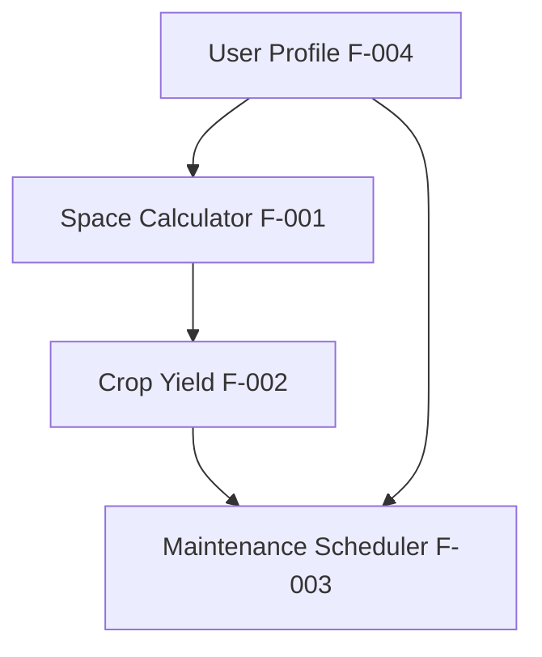

## 2.4. IMPLEMENTATION CONSIDERATIONS

| Feature ID | Technical Constraints | Performance Requirements | Security Implications |
|------------|---------------------|------------------------|---------------------|
| F-001 | React frontend compatibility | <1s calculation time | Input validation |
| F-002 | Golang backend integration | Real-time updates | Data integrity |
| F-003 | Calendar API integration | Background processing | Schedule privacy |

### Scalability Considerations
- Microservices architecture for independent scaling
- Caching for common calculations
- Asynchronous processing for maintenance schedules

### Maintenance Requirements
- Daily database backups
- Weekly performance monitoring
- Monthly yield calculation updates
- Quarterly AI model retraining

# 3. PROCESS FLOWCHART

## 3.1. SYSTEM WORKFLOWS

### Core Business Process Flow

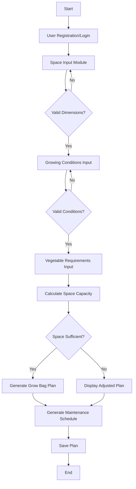

### Integration Workflow

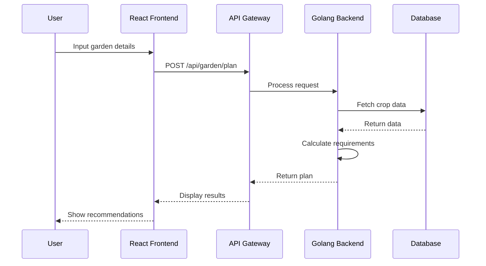

## 3.2. FLOWCHART REQUIREMENTS

### Space Planning Flow

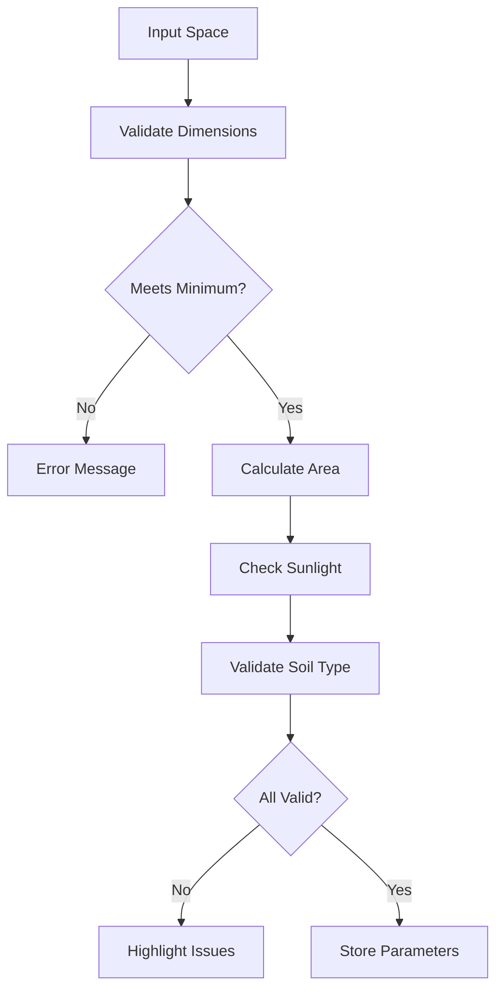

### Crop Planning Flow

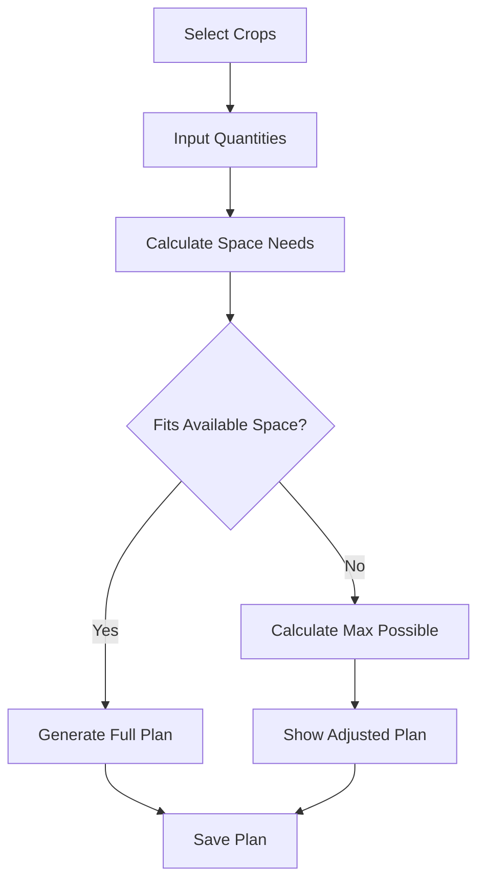

## 3.3. TECHNICAL IMPLEMENTATION

### State Management Diagram

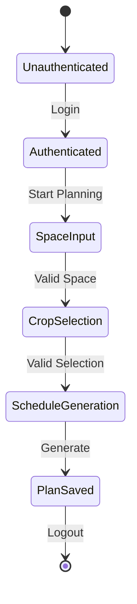

### Error Handling Flow

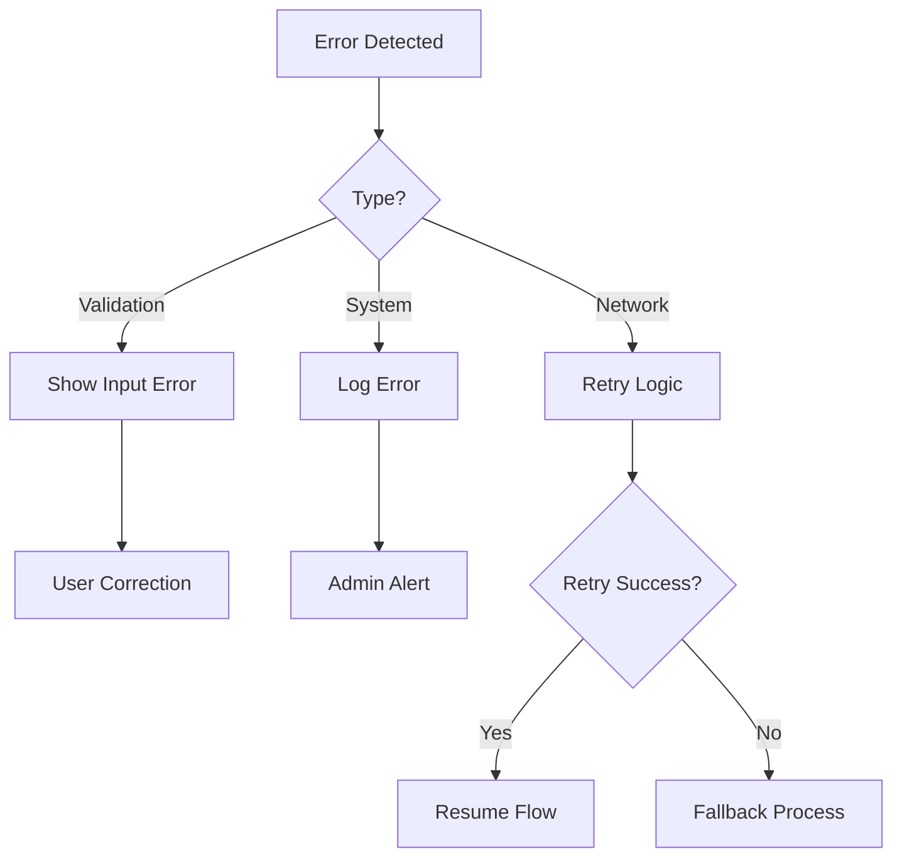

## 3.4. VALIDATION RULES

| Process Step | Validation Rules | Error Handling |
|-------------|------------------|----------------|
| Space Input | - Min area: 10 sq ft<br>- Max area: 1000 sq ft<br>- Valid dimensions | Return error message with valid ranges |
| Soil Type | - Must match predefined types<br>- Required field | Show dropdown with valid options |
| Crop Selection | - Max 10 crops per plan<br>- Valid quantities | Display capacity limits |
| Schedule Generation | - Valid date ranges<br>- Non-conflicting times | Highlight conflicts for resolution |

## 3.5. TIMING CONSTRAINTS

| Process | SLA Target | Retry Logic |
|---------|------------|-------------|
| Space Calculation | <1s | None |
| Crop Plan Generation | <2s | 2 retries |
| Schedule Creation | <3s | 3 retries |
| Plan Storage | <1s | 5 retries |

# 4. SYSTEM ARCHITECTURE

## 4.1. HIGH-LEVEL ARCHITECTURE

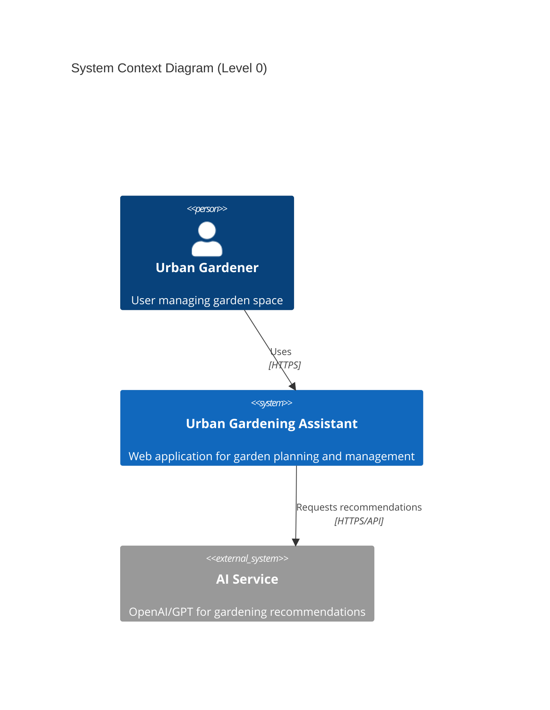

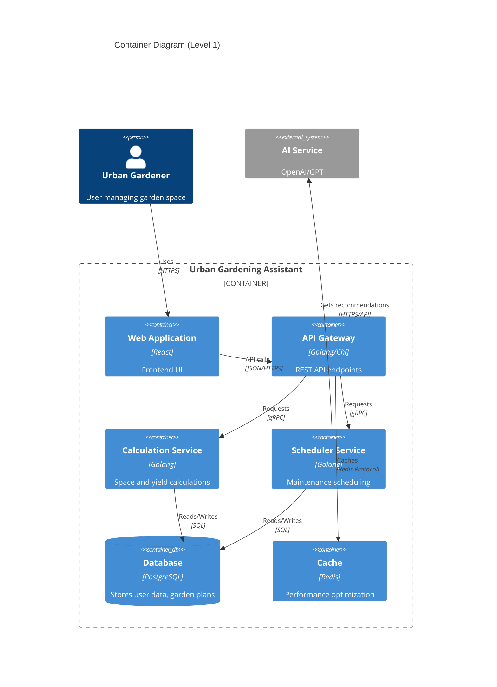

## 4.2. COMPONENT DETAILS

### Frontend Components (React)

| Component | Purpose | Key Technologies | APIs Consumed |
|-----------|---------|-----------------|---------------|
| Space Planner | Garden dimension input and visualization | React, Material-UI | `/api/space` |
| Crop Calculator | Crop selection and yield planning | React Query, Redux | `/api/crops` |
| Schedule Manager | Maintenance schedule interface | React Calendar, Redux | `/api/schedule` |
| Authentication | User login/registration | JWT, OAuth | `/api/auth` |

### Backend Services (Golang)

| Service | Purpose | Technologies | Data Store |
|---------|---------|--------------|------------|
| API Gateway | Request routing and authentication | Chi, JWT | Redis |
| Calculation Engine | Space and yield computations | Go standard lib | PostgreSQL |
| Scheduler | Maintenance planning | Go cron | PostgreSQL |
| AI Integration | External AI service communication | gRPC | Cache |

## 4.3. TECHNICAL DECISIONS

### Architecture Style

| Aspect | Choice | Rationale |
|--------|--------|-----------|
| Pattern | Microservices | Independent scaling, maintainability |
| Communication | gRPC internal, REST external | Performance, standard compatibility |
| Data Storage | PostgreSQL | ACID compliance, relational data |
| Caching | Redis | Performance, session management |
| API Design | RESTful | Standard, well-understood |

## 4.4. CROSS-CUTTING CONCERNS

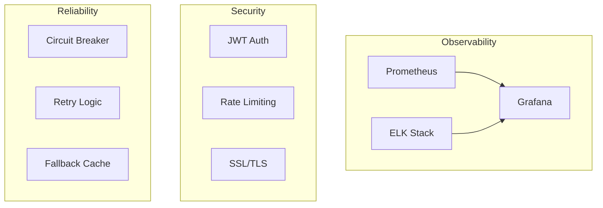

### Monitoring Strategy

| Component | Tool | Metrics |
|-----------|------|---------|
| Application | Prometheus | Response times, error rates |
| Infrastructure | Grafana | Resource utilization |
| Logging | ELK Stack | Error logs, audit trails |
| Tracing | Jaeger | Request flows |

## 4.5. DEPLOYMENT ARCHITECTURE

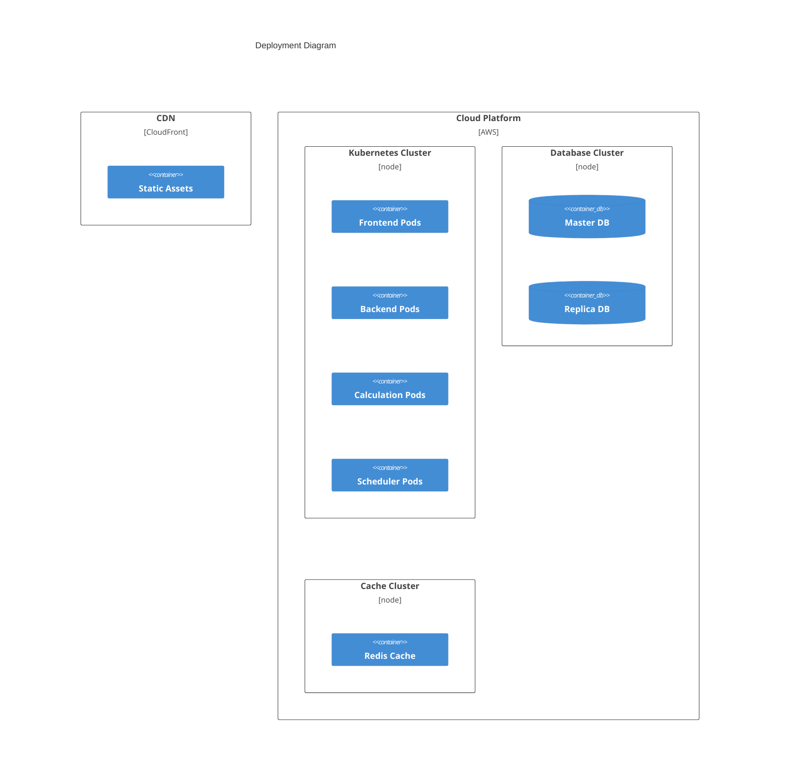

## 4.6. DATA FLOW ARCHITECTURE

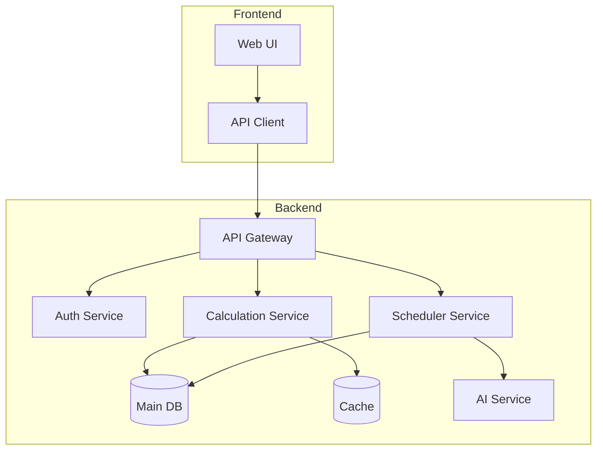

### Data Storage Schema

| Entity | Storage | Backup Strategy | Retention |
|--------|---------|----------------|-----------|
| User Data | PostgreSQL | Daily snapshots | 30 days |
| Sessions | Redis | None | 24 hours |
| Calculations | Redis | None | 1 hour |
| Audit Logs | PostgreSQL | Weekly archive | 90 days |

# 5. SYSTEM COMPONENTS DESIGN

## 5.1. CORE SERVICES ARCHITECTURE

### Service Components

| Service | Responsibility | Communication Pattern | Discovery Method |
|---------|---------------|----------------------|------------------|
| Space Calculator | Garden space optimization | Synchronous REST | Kubernetes Service |
| Crop Manager | Yield calculations and grow bag planning | Synchronous REST | Kubernetes Service |
| Maintenance Scheduler | Schedule generation and notifications | Event-driven | Kubernetes Service |
| AI Advisor | Gardening recommendations | Asynchronous gRPC | Kubernetes Service |

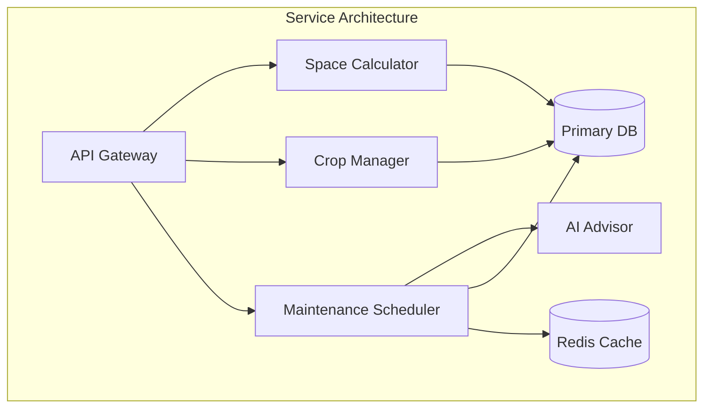

### Load Balancing Strategy

| Component | Strategy | Health Check | Failover |
|-----------|----------|--------------|----------|
| API Gateway | Round Robin | TCP/5s | Auto-reroute |
| Service Mesh | Least Connections | HTTP/10s | Pod recreation |
| Database | Active-Passive | Custom/15s | Automatic |

### Circuit Breaker Configuration

| Service | Threshold | Timeout | Reset Time |
|---------|-----------|---------|------------|
| Space Calculator | 5 failures/10s | 2s | 30s |
| Crop Manager | 3 failures/5s | 3s | 45s |
| AI Advisor | 2 failures/10s | 5s | 60s |

### Scalability Design

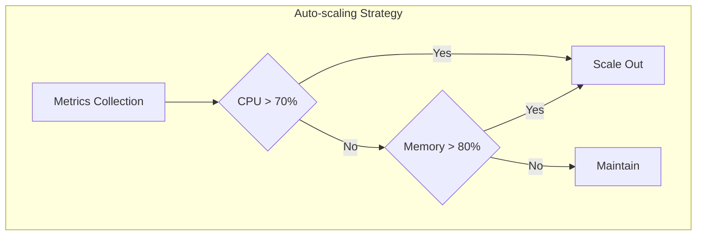

| Resource | Scaling Trigger | Min Pods | Max Pods |
|----------|----------------|-----------|-----------|
| Space Calculator | CPU > 70% | 2 | 10 |
| Crop Manager | Memory > 80% | 2 | 8 |
| Maintenance Scheduler | Requests > 1000/min | 1 | 5 |

### Resilience Patterns

| Pattern | Implementation | Recovery Time |
|---------|---------------|---------------|
| Circuit Breaker | Hystrix | 30s timeout |
| Retry Logic | Exponential backoff | Max 3 attempts |
| Rate Limiting | Token bucket | 1000 req/min |
| Fallback | Cache response | 24h validity |

## 5.2. DATABASE DESIGN

### Schema Design

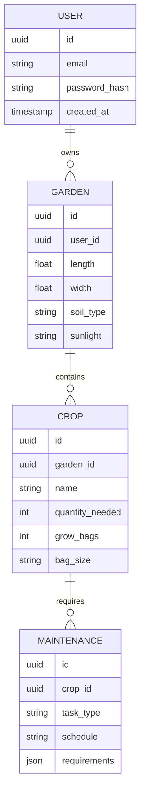

### Indexing Strategy

| Table | Index | Type | Purpose |
|-------|-------|------|---------|
| users | email | UNIQUE B-tree | Login lookup |
| garden | user_id | B-tree | User's gardens |
| crop | garden_id | B-tree | Garden crops |
| maintenance | crop_id, schedule | Composite | Schedule lookup |

### Data Management

| Aspect | Strategy | Retention |
|--------|----------|-----------|
| Backups | Daily snapshots | 30 days |
| Archival | Monthly compression | 1 year |
| Audit logs | Append-only table | 90 days |
| User data | Soft delete | Forever |

## 5.3. INTEGRATION ARCHITECTURE

### API Design

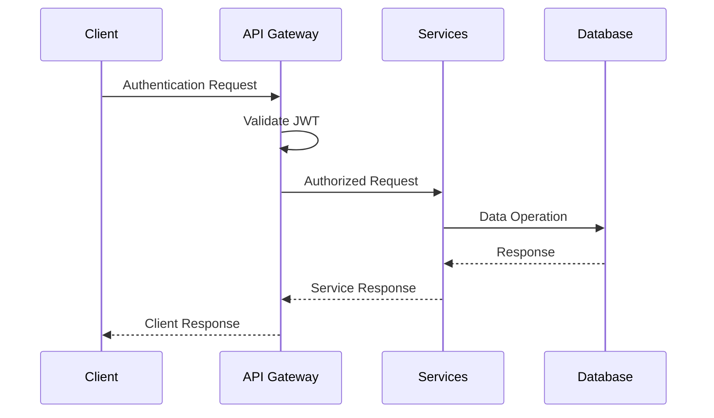

| Endpoint | Method | Rate Limit | Cache TTL |
|----------|--------|------------|-----------|
| /api/v1/garden | POST | 100/hour | None |
| /api/v1/crops | GET | 1000/hour | 1 hour |
| /api/v1/schedule | GET | 500/hour | 5 minutes |

### Message Processing

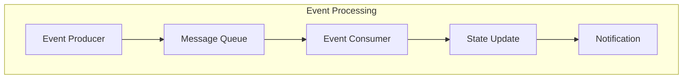

## 5.4. SECURITY ARCHITECTURE

### Authentication Framework

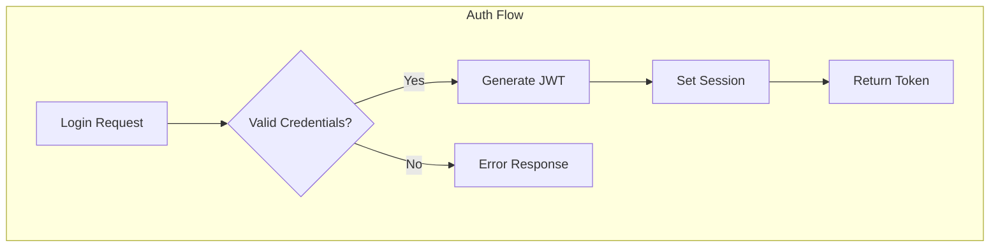

| Security Control | Implementation | Refresh Period |
|-----------------|----------------|----------------|
| JWT Token | HS256 | 1 hour |
| Refresh Token | Secure HTTP-only | 7 days |
| Password Hash | Bcrypt | On change |
| Session | Redis | 24 hours |

### Authorization System

| Role | Permissions | Scope |
|------|------------|-------|
| User | Read, Write own data | Personal garden |
| Admin | Full access | All gardens |
| Service | Internal API access | System wide |

### Data Protection

| Data Type | Encryption | Key Rotation |
|-----------|------------|--------------|
| PII | AES-256 | 90 days |
| Passwords | Bcrypt | N/A |
| API Keys | SHA-256 | 30 days |

# 6. TECHNOLOGY STACK

## 6.1. PROGRAMMING LANGUAGES

| Platform | Language | Version | Justification |
|----------|----------|---------|---------------|
| Frontend | JavaScript/TypeScript | TS 5.0+ | Type safety, React ecosystem compatibility |
| Backend | Go | 1.21+ | High performance, strong concurrency, efficient resource usage |
| Database Queries | SQL | PostgreSQL 15+ | Data integrity, relational model support |
| Infrastructure | HCL | Terraform 1.5+ | Infrastructure as code, AWS compatibility |

## 6.2. FRAMEWORKS & LIBRARIES

### Frontend Stack

| Component | Technology | Version | Purpose |
|-----------|------------|---------|----------|
| Core Framework | React | 18.2+ | Component-based UI, virtual DOM efficiency |
| State Management | Redux Toolkit | 1.9+ | Predictable state management |
| UI Components | Material-UI | 5.14+ | Pre-built components, theming |
| Form Handling | React Hook Form | 7.45+ | Form validation, performance |
| API Client | Axios | 1.4+ | HTTP requests, interceptors |
| Charts/Visualization | D3.js | 7.8+ | Garden space visualization |

### Backend Stack

| Component | Technology | Version | Purpose |
|-----------|------------|---------|----------|
| Web Framework | Chi Router | 5.0+ | Lightweight HTTP routing |
| ORM | GORM | 1.25+ | Database operations, migrations |
| Validation | validator.go | 10.0+ | Input validation |
| Authentication | JWT-Go | 4.0+ | Token-based auth |
| AI Integration | OpenAI Go Client | Latest | AI recommendations |

## 6.3. DATABASES & STORAGE

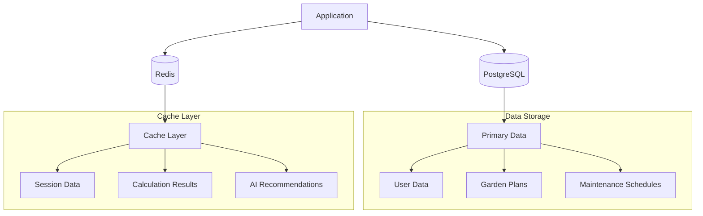

| Storage Type | Technology | Purpose | Retention |
|--------------|------------|---------|-----------|
| Primary Database | PostgreSQL | User data, garden plans | Permanent |
| Cache | Redis | Session management, calculations | Temporary |
| File Storage | S3 | User uploads, exports | Long-term |
| Backup Storage | S3 Glacier | Database backups | Archive |

## 6.4. THIRD-PARTY SERVICES

| Category | Service | Purpose | Integration Method |
|----------|---------|---------|-------------------|
| AI/ML | OpenAI GPT-4 | Gardening recommendations | REST API |
| Authentication | Auth0 | User authentication | OAuth 2.0 |
| Monitoring | Datadog | Application monitoring | Agent-based |
| Error Tracking | Sentry | Error reporting | SDK |
| Cloud Platform | AWS | Infrastructure hosting | SDK/API |

## 6.5. DEVELOPMENT & DEPLOYMENT

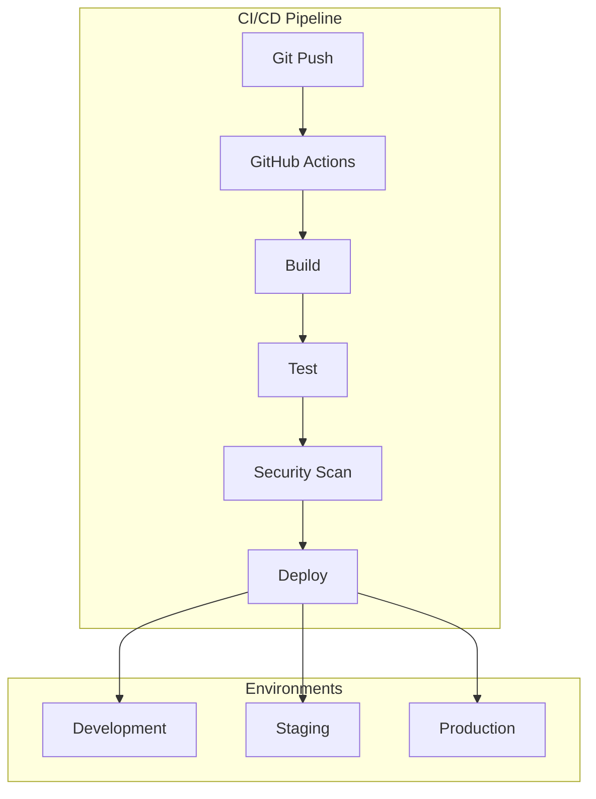

### Development Tools

| Category | Tool | Purpose |
|----------|------|---------|
| IDE | VSCode | Code editing |
| API Testing | Postman | Endpoint testing |
| Version Control | Git | Source control |
| Documentation | Swagger | API documentation |

### Build & Deployment

| Stage | Technology | Configuration |
|-------|------------|---------------|
| Containerization | Docker | Multi-stage builds |
| Container Registry | ECR | Image storage |
| Orchestration | EKS | Container management |
| Infrastructure | Terraform | IaC |
| CI/CD | GitHub Actions | Automation |

### Environment Configuration

| Environment | Purpose | Scaling |
|-------------|---------|---------|
| Development | Local testing | Single instance |
| Staging | Integration testing | Minimal cluster |
| Production | Live service | Auto-scaling |

# 7. USER INTERFACE DESIGN

## 7.1. WIREFRAME KEY

```
SYMBOLS:
[#] - Main menu/dashboard
[@] - User profile
[?] - Help/tooltip
[+] - Add new item
[x] - Close/remove
[!] - Warning/alert
[=] - Settings
[<] [>] - Navigation
[^] - Upload
[*] - Favorite/important

INPUTS:
[...] - Text input field
[ ] - Checkbox
( ) - Radio button
[v] - Dropdown menu
[Button] - Clickable button
[====] - Progress indicator
```

## 7.2. MAIN DASHBOARD

```
+----------------------------------------------------------+
|  Urban Gardening Assistant             [@] Profile [=] Menu|
+----------------------------------------------------------+
|  [#] Dashboard                                            |
|  +------------------------------------------------------+|
|  |                Welcome, {username}!                   ||
|  |  [+] New Garden Plan    [*] Saved Plans              ||
|  +------------------------------------------------------+|
|                                                          |
|  Active Gardens:                                         |
|  +----------------+  +----------------+  +----------------+|
|  | Balcony Garden |  | Terrace Plot  |  | Window Box    ||
|  | 50 sq ft       |  | 100 sq ft     |  | 10 sq ft      ||
|  | 4 crops        |  | 6 crops       |  | 2 crops       ||
|  | [>] View       |  | [>] View      |  | [>] View      ||
|  +----------------+  +----------------+  +----------------+|
+----------------------------------------------------------+
```

## 7.3. GARDEN SPACE PLANNER

```
+----------------------------------------------------------+
|  New Garden Plan                      [?] Help    [x] Close|
+----------------------------------------------------------+
|  Step 1: Space Details                                    |
|  +------------------------------------------------------+|
|  | Dimensions:                                           ||
|  | Length: [...] ft/m    Width: [...] ft/m              ||
|  |                                                       ||
|  | Sunlight Conditions:                                  ||
|  | ( ) Full Sun    ( ) Partial Shade    ( ) Full Shade  ||
|  |                                                       ||
|  | Soil Type: [v]                                       ||
|  | [Red Soil]                                           ||
|  | [Sandy Soil]                                         ||
|  | [Loamy Soil]                                         ||
|  +------------------------------------------------------+|
|  [< Back]                              [Next >]           |
+----------------------------------------------------------+
```

## 7.4. CROP SELECTION INTERFACE

```
+----------------------------------------------------------+
|  Crop Planning                        [?] Help    [x] Close|
+----------------------------------------------------------+
|  Step 2: Vegetable Requirements                           |
|  +------------------------------------------------------+|
|  | Add Vegetables:                                       ||
|  | [+] Add New Vegetable                                ||
|  |                                                       ||
|  | Selected Crops:                                       ||
|  | +------------------------------------------------+  ||
|  | | Vegetable   | Daily Qty | Grow Bags | Remove   |  ||
|  | |-------------------------------------------------  ||
|  | | Tomatoes    | 1 kg      | 10 x 12"  | [x]      |  ||
|  | | Spinach     | 500g      | 4 x 8"    | [x]      |  ||
|  | +------------------------------------------------+  ||
|  |                                                       ||
|  | [!] Space Utilization: [=========] 90%               ||
|  +------------------------------------------------------+|
|  [< Back]                              [Next >]           |
+----------------------------------------------------------+
```

## 7.5. MAINTENANCE SCHEDULER

```
+----------------------------------------------------------+
|  Maintenance Schedule                 [?] Help    [x] Close|
+----------------------------------------------------------+
|  Step 3: Care Schedule                                    |
|  +------------------------------------------------------+|
|  | Schedule Type:                                        ||
|  | ( ) AI Recommended    ( ) Manual Setup               ||
|  |                                                       ||
|  | Tomatoes - Grow Bag #1                               ||
|  | +------------------------------------------------+  ||
|  | | Task         | Frequency  | Amount    | Time    |  ||
|  | |-------------------------------------------------  ||
|  | | Fertilizer   | Weekly     | 50g       | Morning |  ||
|  | | Water        | Daily      | 500ml     | 6:00 AM |  ||
|  | | Composting   | Bi-weekly  | 100g      | Any     |  ||
|  | +------------------------------------------------+  ||
|  |                                                       ||
|  | [+] Add Task    [*] Save as Template                 ||
|  +------------------------------------------------------+|
|  [< Back]                              [Save Plan]        |
+----------------------------------------------------------+
```

## 7.6. RESPONSIVE DESIGN BREAKPOINTS

| Screen Size | Layout Adjustments |
|-------------|-------------------|
| Desktop (>1024px) | Full 3-column layout |
| Tablet (768-1024px) | 2-column layout |
| Mobile (<768px) | Single column, stacked elements |

## 7.7. COLOR SCHEME

| Element | Color (Hex) | Usage |
|---------|------------|-------|
| Primary | #2E7D32 | Headers, buttons |
| Secondary | #81C784 | Accents, icons |
| Background | #F5F5F5 | Main background |
| Text | #333333 | Body text |
| Warning | #F44336 | Error messages |
| Success | #4CAF50 | Confirmation |

## 7.8. INTERACTION PATTERNS

| Element | Action | Response |
|---------|--------|----------|
| Add Crop | Click [+] | Opens crop selection modal |
| Space Input | Enter value | Auto-calculates capacity |
| Schedule | Toggle AI/Manual | Updates schedule options |
| Save | Click button | Shows progress indicator |
| Validation | Invalid input | Red border + error message |

# 8. INFRASTRUCTURE

## 8.1. DEPLOYMENT ENVIRONMENT

| Environment | Platform | Purpose | Scaling Strategy |
|------------|----------|---------|------------------|
| Development | Local/Docker | Development and testing | Manual scaling |
| Staging | AWS EKS | Integration testing | Limited auto-scaling |
| Production | AWS EKS | Live application | Full auto-scaling |

### Environment Configuration Matrix

| Component | Development | Staging | Production |
|-----------|------------|---------|------------|
| Compute | t3.medium | t3.large | t3.xlarge |
| Memory | 4GB | 8GB | 16GB |
| Storage | 20GB SSD | 50GB SSD | 100GB SSD |
| Database | Single instance | Multi-AZ | Multi-AZ + Read replicas |
| Caching | Local Redis | ElastiCache (small) | ElastiCache (large) |

## 8.2. CLOUD SERVICES

```mermaid
graph TD
    subgraph "AWS Infrastructure"
        A[Route 53] --> B[CloudFront]
        B --> C[ALB]
        C --> D[EKS Cluster]
        D --> E[EC2 Node Group]
        D --> F[RDS PostgreSQL]
        D --> G[ElastiCache Redis]
        H[S3] --> B
        I[ECR] --> D
    end
```

| Service | Purpose | Configuration |
|---------|---------|---------------|
| EKS | Container orchestration | 1.25+ version, managed node groups |
| RDS | PostgreSQL database | Multi-AZ, 15.x version |
| ElastiCache | Redis caching | Cluster mode enabled |
| CloudFront | CDN | Edge locations with SSL |
| Route 53 | DNS management | Weighted routing |
| ECR | Container registry | Image vulnerability scanning |
| S3 | Static assets, backups | Versioning enabled |

## 8.3. CONTAINERIZATION

### Docker Configuration

```mermaid
graph TD
    subgraph "Container Architecture"
        A[Frontend Container] --> D[Nginx]
        B[Backend Container] --> E[Golang Binary]
        C[Cache Container] --> F[Redis]
        G[DB Container] --> H[PostgreSQL]
    end
```

| Container | Base Image | Optimization |
|-----------|------------|--------------|
| Frontend | node:alpine | Multi-stage build |
| Backend | golang:alpine | Multi-stage build |
| Redis | redis:alpine | Custom config |
| PostgreSQL | postgres:15-alpine | Custom config |

### Resource Limits

| Container | CPU Limit | Memory Limit | Storage |
|-----------|-----------|--------------|---------|
| Frontend | 0.5 CPU | 512Mi | 256Mi |
| Backend | 1.0 CPU | 1Gi | 512Mi |
| Redis | 0.5 CPU | 1Gi | 1Gi |
| PostgreSQL | 2.0 CPU | 4Gi | 20Gi |

## 8.4. ORCHESTRATION

### Kubernetes Architecture

```mermaid
graph TD
    subgraph "Kubernetes Cluster"
        A[Ingress Controller] --> B[Frontend Service]
        A --> C[Backend Service]
        B --> D[Frontend Pods]
        C --> E[Backend Pods]
        E --> F[Redis Service]
        E --> G[PostgreSQL Service]
        F --> H[Redis StatefulSet]
        G --> I[PostgreSQL StatefulSet]
    end
```

### Kubernetes Resources

| Resource | Type | Replicas | Auto-scaling |
|----------|------|----------|--------------|
| Frontend | Deployment | 2-5 | CPU > 70% |
| Backend | Deployment | 3-10 | CPU > 70% |
| Redis | StatefulSet | 3 | None |
| PostgreSQL | StatefulSet | 2 | None |

## 8.5. CI/CD PIPELINE

```mermaid
graph TD
    A[Git Push] --> B[GitHub Actions]
    B --> C[Code Quality]
    B --> D[Unit Tests]
    B --> E[Security Scan]
    C --> F[Build Images]
    D --> F
    E --> F
    F --> G[Push to ECR]
    G --> H{Environment}
    H -->|Dev| I[Dev EKS]
    H -->|Staging| J[Staging EKS]
    H -->|Prod| K[Production EKS]
```

### Pipeline Stages

| Stage | Tools | Success Criteria |
|-------|-------|-----------------|
| Code Quality | SonarQube | Coverage > 80% |
| Unit Tests | Go test, Jest | Pass rate 100% |
| Security Scan | Snyk, Trivy | No high vulnerabilities |
| Build | Docker | Successful multi-stage build |
| Deploy | Helm | Rolling update success |

### Deployment Strategy

| Environment | Strategy | Rollback Plan |
|------------|----------|---------------|
| Development | Direct deploy | Manual revert |
| Staging | Blue/Green | Automatic switch |
| Production | Canary | Gradual rollout |

# APPENDICES

## A.1. ADDITIONAL TECHNICAL INFORMATION

### Grow Bag Size Reference Table

| Vegetable | Bag Size | Plants per Bag | Daily Yield (approx.) |
|-----------|----------|----------------|----------------------|
| Tomatoes | 12 inch (30 cm) | 1 | 200-250g |
| Spinach | 8 inch (20 cm) | 4 | 100-150g |
| Lettuce | 10 inch (25 cm) | 2 | 150-200g |
| Peppers | 12 inch (30 cm) | 2 | 100-150g |
| Eggplant | 14 inch (35 cm) | 1 | 200-250g |

### Soil Type Characteristics

| Soil Type | Characteristics | Best For | Water Retention |
|-----------|----------------|-----------|-----------------|
| Red Soil | Iron-rich, slightly acidic | Root vegetables | Moderate |
| Sandy Soil | Well-draining, low nutrients | Herbs, carrots | Low |
| Loamy Soil | Balanced, nutrient-rich | Most vegetables | High |
| Clay Soil | Dense, nutrient-rich | Leafy greens | Very high |
| Black Soil | Rich in organic matter | All vegetables | High |

### Composting Schedule Reference

```mermaid
graph TD
    A[Initial Planting] -->|Week 0| B[Vermicompost 50g]
    B -->|Week 2| C[Banana Peel Compost]
    C -->|Week 4| D[NPK Mix]
    D -->|Week 6| E[Organic Fertilizer]
    E -->|Week 8| F[Repeat Cycle]
```

## A.2. GLOSSARY

| Term | Definition |
|------|------------|
| Grow Bag | Fabric container for growing plants, allows air pruning of roots |
| Vermicompost | Composted material produced by earthworms |
| NPK | Nitrogen, Phosphorus, and Potassium ratio in fertilizers |
| Air Pruning | Natural root pruning when exposed to air |
| Companion Planting | Strategic placement of compatible plants |
| Crop Rotation | Systematic planting sequence to maintain soil health |
| Urban Gardening | Practice of growing plants in urban spaces |
| Vertical Gardening | Growing plants upward to maximize space |

## A.3. ACRONYMS

| Acronym | Full Form |
|---------|-----------|
| API | Application Programming Interface |
| UI | User Interface |
| JWT | JSON Web Token |
| REST | Representational State Transfer |
| CRUD | Create, Read, Update, Delete |
| SQL | Structured Query Language |
| NPK | Nitrogen, Phosphorus, Potassium |
| AWS | Amazon Web Services |
| EKS | Elastic Kubernetes Service |
| ECR | Elastic Container Registry |
| RDS | Relational Database Service |
| SSL | Secure Sockets Layer |
| CI/CD | Continuous Integration/Continuous Deployment |
| DNS | Domain Name System |
| CPU | Central Processing Unit |
| RAM | Random Access Memory |
| SSD | Solid State Drive |
| HTTP | Hypertext Transfer Protocol |
| HTTPS | Hypertext Transfer Protocol Secure |
| JSON | JavaScript Object Notation |
| HTML | Hypertext Markup Language |
| CSS | Cascading Style Sheets |